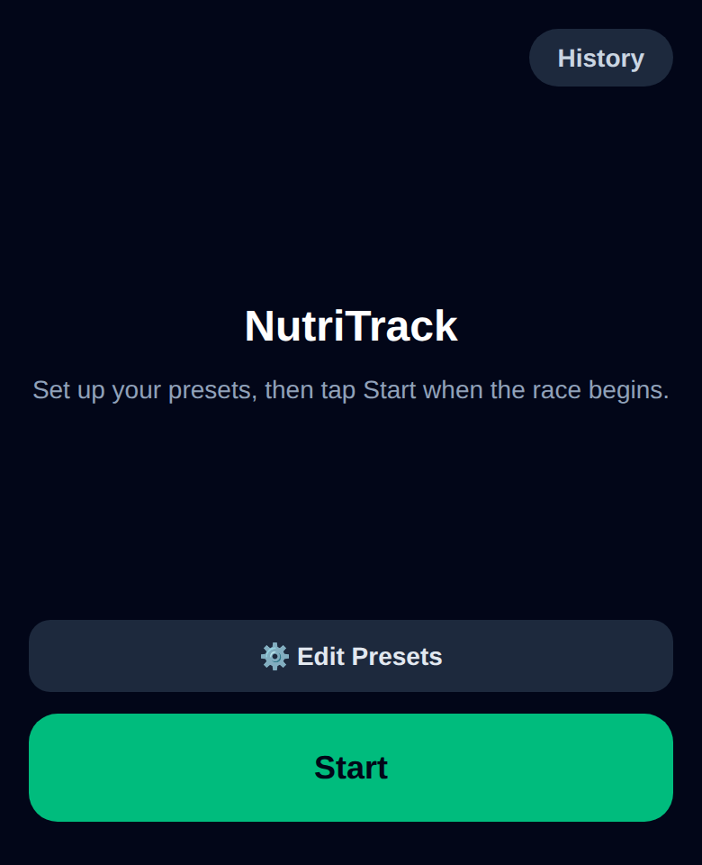
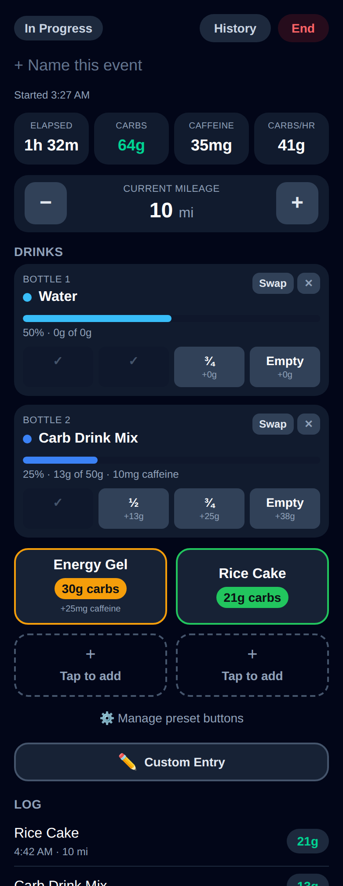
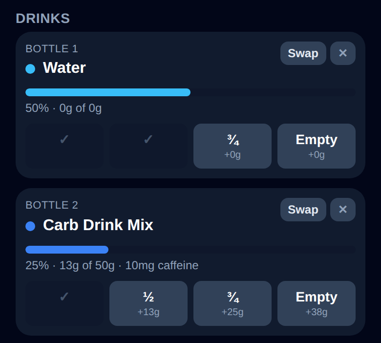
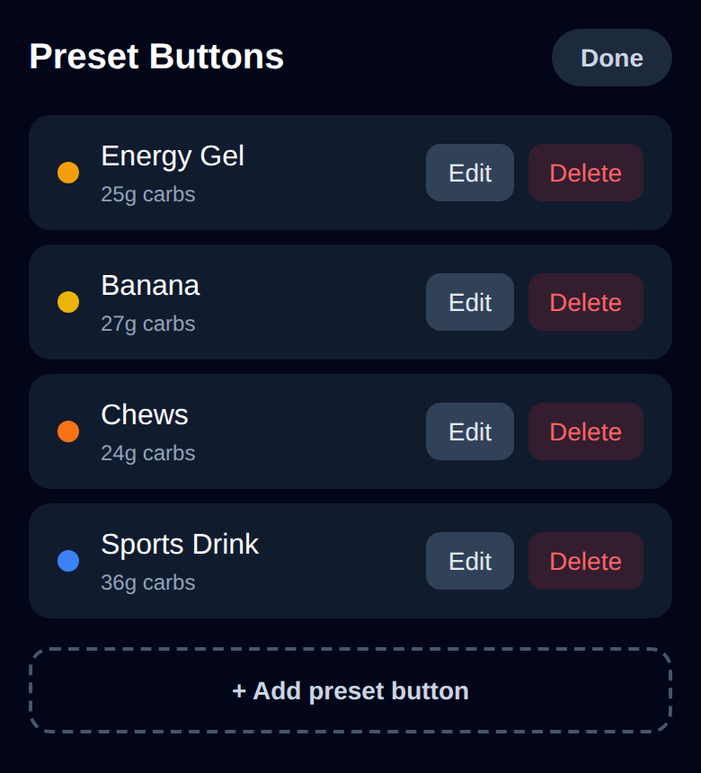
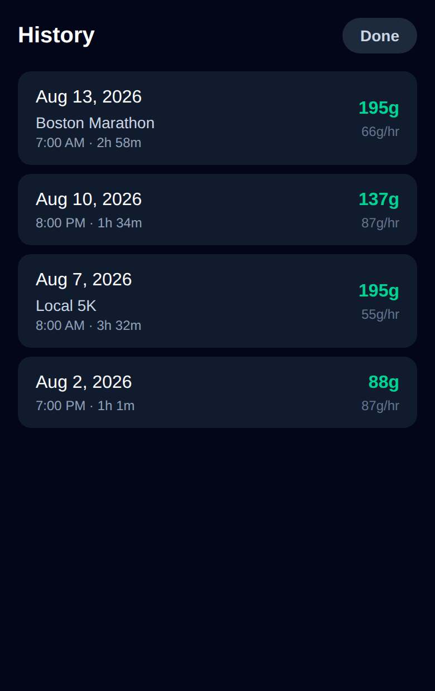
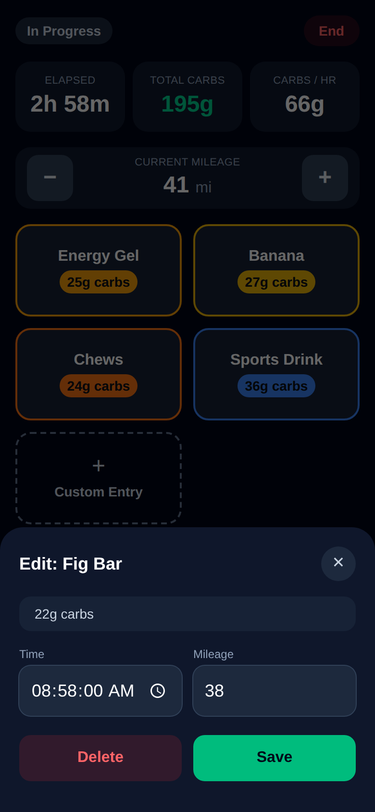
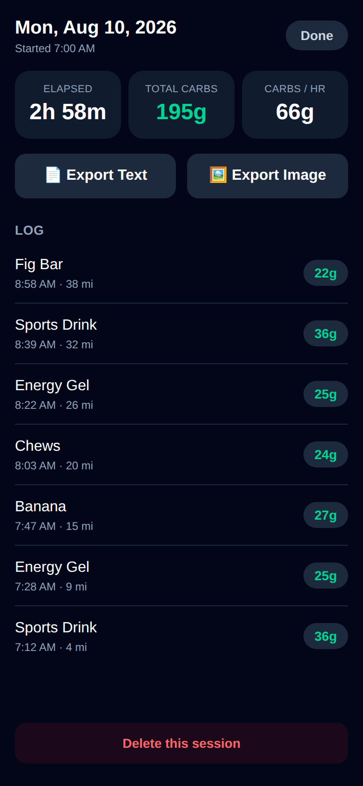
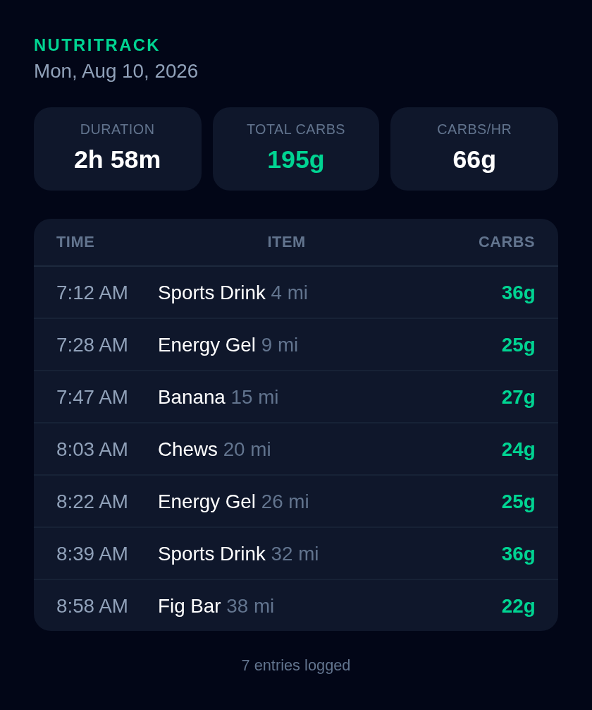

# NutriTrack

A single-page web app for tracking nutrition consumption during runs and bike
rides — designed for big, glove/sweat-friendly buttons you can hit mid-activity.

**Live app:** https://awhlam.github.io/nutritrack/

<p align="center">
  
</p>
<p align="center">
  <em>Set up your presets, then tap Start when the gun goes off — nothing runs until you do</em>
</p>

## Features

- **Start when you're ready** — the app opens to a start screen so you can review or edit your presets first; tracking only begins once you tap Start. Reopening later resumes whatever's still in progress.
- **Auto-ends forgotten sessions** — if a session sits with no new entries or edits for 6 hours (e.g. you forgot to tap "End"), it's automatically closed using the time of that last activity.
- **Name your event** — tap "+ Name this event" (during the activity or afterward) to label a session, e.g. "Boston Marathon". Shows up in History, on the summary screen, and in both export formats; unnamed sessions just show their date, as before.
- **One-tap logging** — preset buttons for the nutrition you bring. Tapping one instantly logs the time and your current mileage.
- **Tap-to-add preset slots** — the button grid always shows a few empty slots alongside your configured ones; tap an empty one to define a new preset (label, carbs, optional caffeine, color) right there.
- **Carbs and caffeine** — every preset and entry tracks both; caffeine is optional and only shown once you actually set it, so items that don't have any stay uncluttered.
- **Two drink bottle slots** — assign what's in each bottle, then log how much you've drunk in quarters (¼ / ½ / ¾ / Empty). Each log only counts the amount consumed *since* the last one — no double-counting — and progress is derived from the log itself, so editing or deleting an entry can't leave it out of sync.
- **Custom entries** — a distinct full-width button (not just another preset tile) for logging anything unplanned with a label, carb count, and optional caffeine, or logging it now and filling in the carbs later (e.g. an aid-station snack you can't identify mid-stride).
- **Mileage tracking** — a big +/− stepper in whole miles (tap the number to type an exact value), snapshotted onto each entry you log.
- **Live stats** — running totals for elapsed time, total carbs, total caffeine, and carbs/hour, updated in real time. Entries still missing a carb count are flagged and excluded from the totals until filled in.
- **Editable log** — every entry's time, mileage, carb count, and caffeine can be corrected after the fact; entries can also be deleted. A session's own start time (and end time, once finished) is editable the same way.
- **Preset manager** — add, edit, or delete your preset nutrition buttons and drinks, reachable from the grid or via a History button in the tracker header.
- **History** — past activities are saved locally so you can review them later.
- **Export** — at the end of a session, export the log as a plain-text summary (`.txt`) or a shareable image (`.png`).

All data is stored locally in the browser (`localStorage`) — no account or
backend required.

<p align="center">
  
</p>

### Drinks

Assign a bottle to each of the two slots — pick an existing drink or create one
on the spot with its total carb count and optional caffeine. Log progress as
you drink it with the quarter buttons; each tap only adds the delta since your
last log, so there's no way to double-count. Finishing a bottle and swapping
in a new one resets that slot's progress without touching your history.

<p align="center">
  
</p>

### Presets and history

Item presets live in a small grid with a couple of empty "Tap to add" slots
built in, so setting up what you carry doesn't require a trip to the manager
first. The manager itself splits items and drinks into separate tabs for
editing or deleting. In History, named sessions show their name under the
date; unnamed ones just show the date, as they always have.

<p align="center">
  
  
</p>

### Editing entries

Every logged entry — time, mileage, carb count, and caffeine — can be
corrected after the fact, including filling in a carb count you deliberately
skipped at the time.

<p align="center">
  
  
</p>

### Export

"Export Image" renders a shareable summary card; on a phone it hands off to the
native share sheet, so it can go straight into Messages or Strava.

<p align="center">
  
</p>

<details>
<summary>"Export Text" produces the same log as plain text</summary>

```
NutriTrack
Thursday, August 13, 2026

Duration:       1h 58m
Total Carbs:    94 g (excludes pending entries below)
Total Caffeine: 75 mg
Avg Carbs/hr:   48 g/hr
Entries:        7

Time       Mileage   Item                      Carbs    Caffeine
------------------------------------------------------------------
7:12 AM    4 mi      Energy Gel                30g      25mg
7:22 AM    7 mi      Water (+25%)              0g       0mg
7:45 AM    14 mi     Carb Drink Mix (+25%)     13g      10mg
8:00 AM    18 mi     Rice Cake                 21g      0mg
8:15 AM    23 mi     Water (+25%)              0g       0mg
8:35 AM    29 mi     Energy Gel                30g      25mg
8:50 AM    34 mi     Aid station bar           ?        15mg

Logged with NutriTrack
```

</details>

## Development

```bash
npm install
npm run dev      # start local dev server
npm run build    # type-check and build for production
npm test         # run the test suite
npm run lint     # lint
```

## Tests

[Vitest](https://vitest.dev) covers the fueling and caffeine math and
formatting in `src/lib/format.test.ts`, drink-slot percent derivation in
`src/lib/drinks.test.ts`, the 6-hour inactivity threshold in
`src/lib/session.test.ts`, the versioned preset-default migration and
activity/caffeine backfills in `src/lib/storage.test.ts`,
session/entry/preset/drink-slot state — including the auto-end-on-inactivity
behavior (using fake timers) — in `src/hooks/useStore.test.ts`, the
start-then-track flow in `src/App.test.tsx`, and components (mileage
stepper, drink slots, preset grid, editable session times, the start screen)
in `src/components/*.test.tsx`.

## Deployment

Pushes to `main` build and publish to GitHub Pages via
`.github/workflows/deploy.yml`. See [docs/DEPLOY.md](docs/DEPLOY.md) for the
one-time repo setup and for other hosts.

The app is installable — "Add to Home Screen" gives it its own icon and a
standalone window, and it keeps working with no signal once loaded.

## Tech stack

React + TypeScript + Vite + Tailwind CSS, with
[html-to-image](https://github.com/bubkoo/html-to-image) for PNG export and
[vite-plugin-pwa](https://vite-pwa-org.netlify.app/) for offline support.
